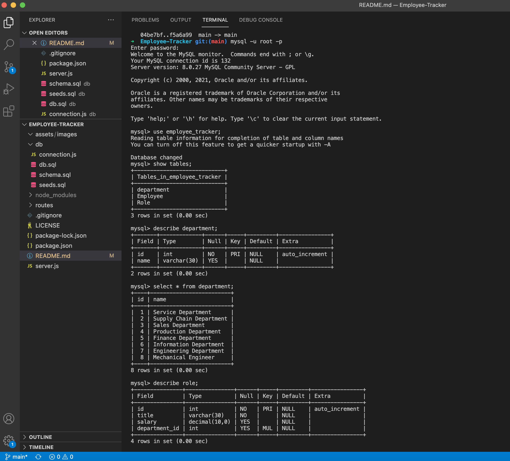
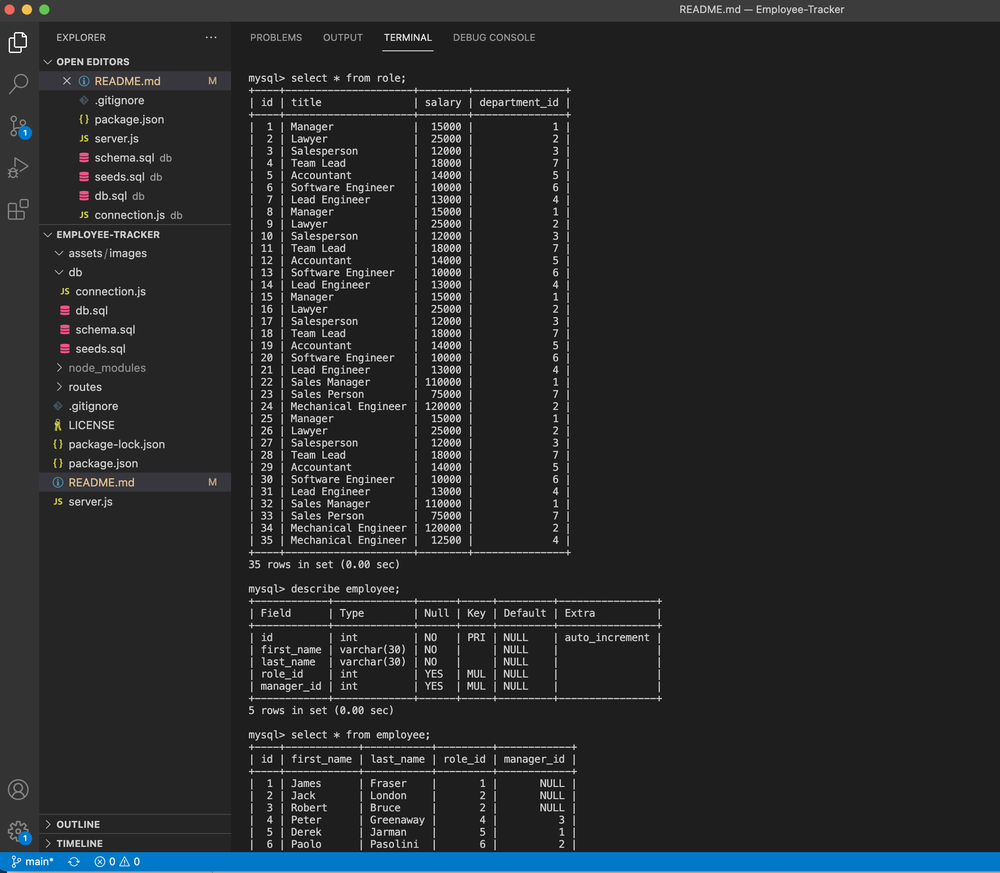
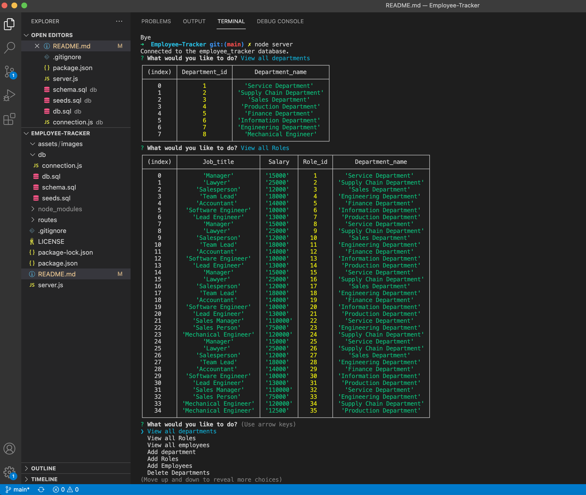
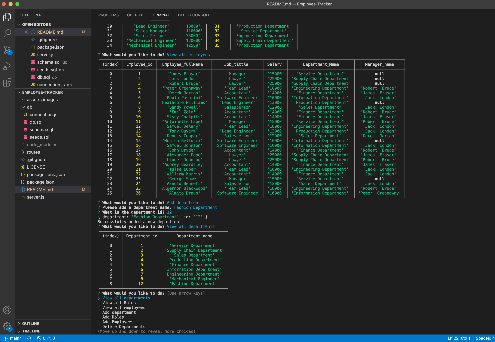
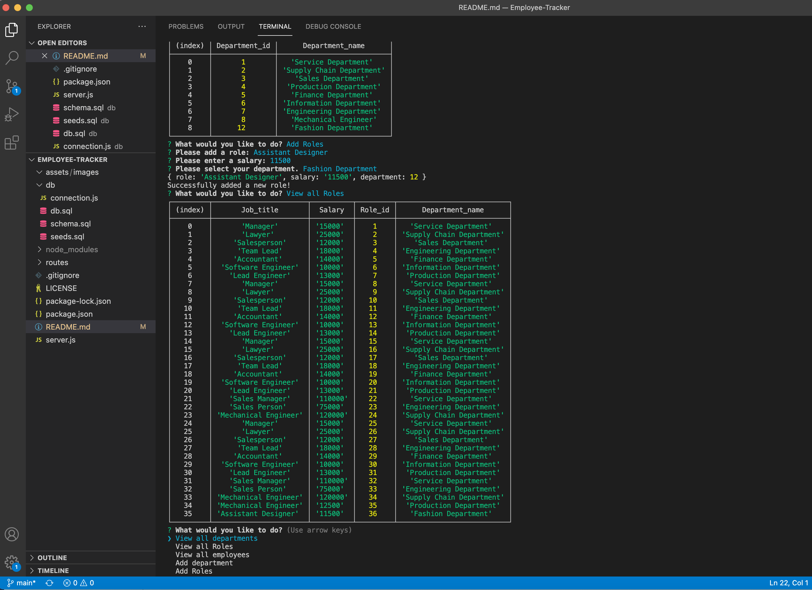

# Employee-Tracker

## Assignment Tasks
My assignment this week is to build a command-line application from scratch to manage a company's employee database, using Node.js, Inquirer, and MySQL.

I need to build an application where user will be able to view and manage the departments, roles, and employees in a company to organize and plan business.

It should used command-line that accepts user input that presented with the following options: view all departments, view all roles, view all employees, add a department, add a role, add an employee, and update an employee role.

And when choosing to 'view all departments', then presented with a formatted table showing department names and department ids.WHEN 'view all roles' was choosen,then presented with the job title, role id, the department that role belongs to, and the salary for that role. When 'view all employees' were choosen,then a formatted table showing employee data, including employee ids, first names, last names, job titles, departments, salaries, and managers that the employees report to were presented.When 'add a department',then the promtps to enter the name of the department and that department is added to the database.When 'add a role',then prompts to enter the name, salary, and department for the role and that role is added to the database. When 'add an employee',then prompts to enter the employee’s first name, last name, role, and manager, and that employee is added to the database. And when 'update an employee role',then prompts to select an employee to update and their new role and this information is updated in the database.

## WALKTHROUGH VIDEO OF APPLICATION FUNCTIONALITY

[Please visit the link for demonstration](https://www.youtube.com/watch?v=GbG3Z9zF2gk)

## USAGE
    npm init -y
    npm i express mysql2
    npm i inquirer
    npm i console.table
    run mysql -u root -p on mysql CLI 
    create database and tables
Then create connection to query or database and run node server.js answer the promts of what you wanna do and it will return you a table of data depends on what action you choose as the snaphot demonstrate below:

When you want to add department it will be added to the table department as shown in the photo.

When you want to add role it will be added in the table role and the same on other commands prompts.

The table format after you require the npm package console.table.

### QUESTIONS
Please email me at: <a href="mailto:aungonalna58@gamil.com"> aungonalna58@gmail.com</a>
